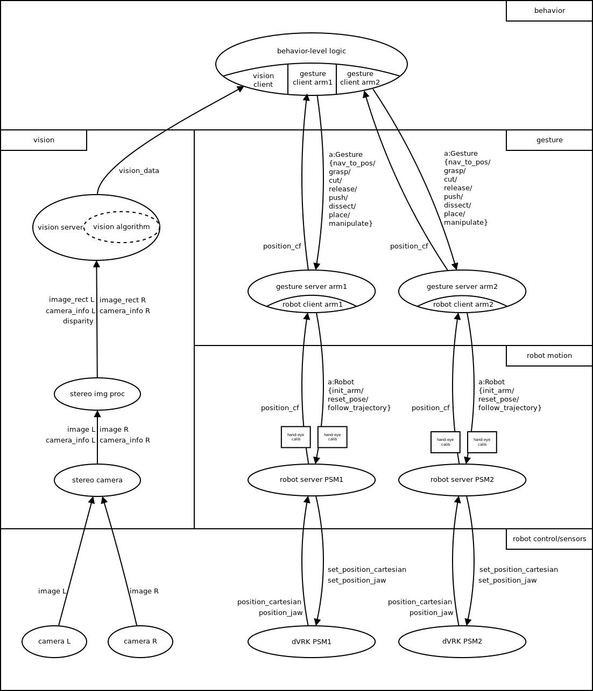

# irob-autosurg
IROB Subtask Automation Library fom Minimally Invasive Surgery

# List of Packages
* irob_msgs
* irob_utils
* irob_robot_interface
* irob_motion
* irob_vision_support
* irob_task

# Dependencies
This sowfware is using the Eigen C++ template library for matrix and vector classes and algorithms. Install Eigen as follows:

Clone the github repository in any folder of your choice (in this example we use the ~/Downloads folder):

    cd ~/Downloads
    git clone https://github.com/eigenteam/eigen-git-mirror.git

Make a build directory, build and install Eigen:

     cd ~/Downloads/eigen-git-miorror
     mkdir build_dir
     cd build_dir
     cmake ../
     sudo make install

Now the Eigen headers should be in your /usr/include/eigen3 directory. Since Eigen is in the eigen3 subdirectory, build commands should include the -I /usr/include/eigen3 option.

ROS packages using the Eigen library have to list the /usr/include/eigen3 in the include_directories in the CMakelist.txt file of the package, for example:

## Specify additional locations of header files
## Your package locations should be listed before other locations
include_directories(include ${catkin_INCLUDE_DIRS} 
      /usr/include/eigen3
)

The library can be used stand-alone, but it was developed to use with the [da Vinci Reserach Kit v1.4](https://github.com/jhu-dvrk/sawIntuitiveResearchKit/wiki), icluding the [cisst-saw](https://github.com/jhu-cisst/cisst/wiki/Compiling-cisst-and-SAW-with-CMake#13-building-using-catkin-build-tools-for-ros) and the [dvrk-ros](https://github.com/jhu-dvrk/sawIntuitiveResearchKit/wiki/CatkinBuild#dvrk-ros) packages.

# Install
TODO

# Usage
TODO

## Acknowledgement
We acknowledge the financial support of this work by the Hungarian State and the European Union under the  EFOP-3.6.1-16-2016-00010 project.

Start simulation: 
* roslaunch dvrk_robot dvrk_arm_rviz.launch arm:=PSM1 config:=/home/<USERNAME>/catkin_ws/src/cisst-saw/sawIntuitiveResearchKit/share/console-PSM1_KIN_SIMULATED.json

