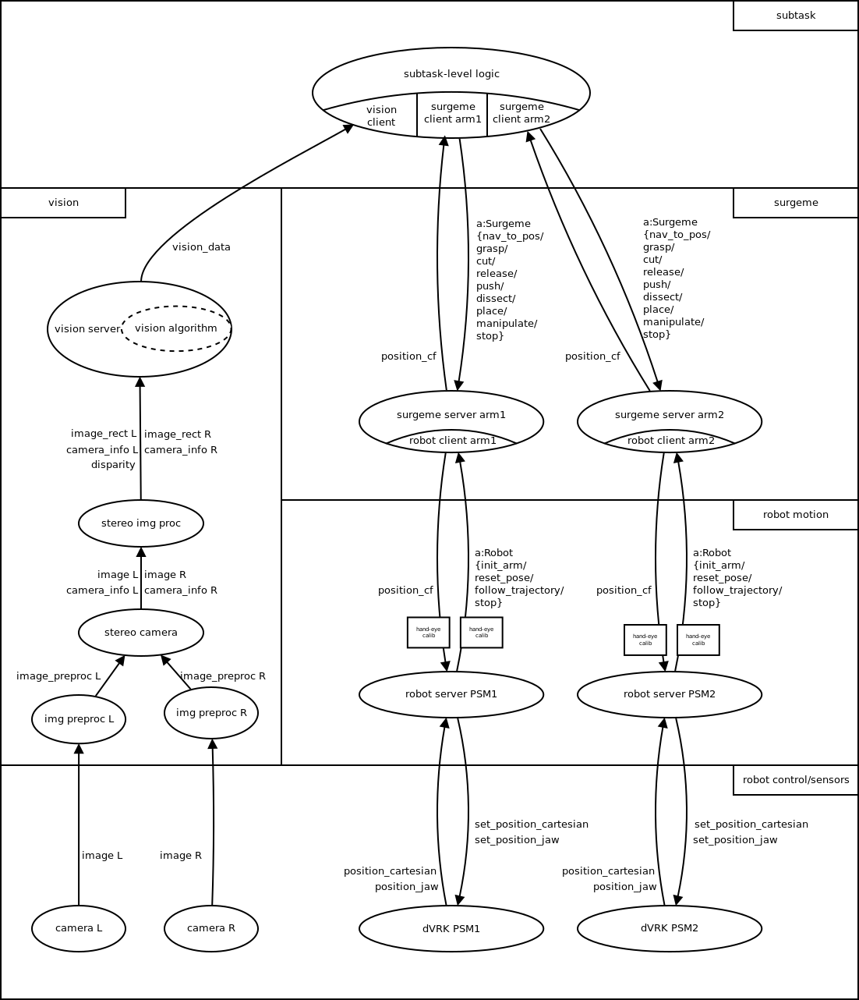

# irob-saf

## About
The *iRob Surgical Automation Framework*---`irob-saf`--- is an open-source ROS-based metapackage, built by the Antal Bejczy Center for Intelligent Robotics (iRob), for the aim to support the research of partial automation in robot-assisted surgery.  The packages of the framework implements basic functionalities, usable as universal building blocks in surgical automation, such as infrastructure to implement subtask-level logic, interfacing of stereo cameras, a hierarchic motion library with parameterizable surgemes, and high-level robot control. The framework were built and tested alongside the da Vinci Resarch Kit (dVRK), however it is easily portable to other platforms as well.

## List of Packages
* [irob_msgs](https://github.com/ABC-iRobotics/irob-saf/tree/master/irob_msgs)
* [irob_utils](https://github.com/ABC-iRobotics/irob-saf/tree/master/irob_utils)
* [irob_robot](https://github.com/ABC-iRobotics/irob-saf/tree/master/irob_robot)
* [irob_motion](https://github.com/ABC-iRobotics/irob-saf/tree/master/irob_motion)
* [irob_vision_support](https://github.com/ABC-iRobotics/irob-saf/tree/master/irob_vision_support)
* [irob_subtask_logic](https://github.com/ABC-iRobotics/irob-saf/tree/master/irob_subtask_logic)

## Build

The framework is tested on Ubuntu 16.04 LTS with ROS Kinetic [recommended by dVRK](https://github.com/jhu-dvrk/sawIntuitiveResearchKit/wiki/Development-Environment) from October 2017, so this platform is encouraged. The building process can be performed using catkin build tools for ROS (so use `catkin build`, but you should never `catkin_make`) by the following steps.

### Install ROS Kinetic

Type:

    sudo sh -c 'echo "deb http://packages.ros.org/ros/ubuntu $(lsb_release -sc) main" > /etc/apt/sources.list.d/ros-latest.list'
    sudo apt-key adv --keyserver hkp://ha.pool.sks-keyservers.net:80 --recv-key 421C365BD9FF1F717815A3895523BAEEB01FA116
    sudo apt update
    sudo apt install ros-kinetic-desktop-full

Initialize rosdep:

    sudo rosdep init
    rosdep update

Setup environment:

    echo "source /opt/ros/kinetic/setup.bash" >> ~/.bashrc
    source ~/.bashrc

#### Install dependencies for building packages

    sudo apt install python-rosinstall python-rosinstall-generator python-wstool build-essential python-catkin-tools

#### ROS webcam support	

    sudo apt install ros-kinetic-cv-camera
    sudo apt install ros-kinetic-camera-calibration

### Install Eigen

This sowfware is using the [Eigen C++ template library](http://eigen.tuxfamily.org/index.php?title=Main_Page) for matrix and vector classes and algorithms. Install Eigen as follows:

Clone the github repository in any folder of your choice (in this example we use the ~/Downloads folder):

    cd ~/Downloads
    git clone https://github.com/eigenteam/eigen-git-mirror.git

Make a build directory, build and install Eigen:

     cd ~/Downloads/eigen-git-miorror
     mkdir build_dir
     cd build_dir
     cmake ../
     sudo make install

Now the Eigen headers should be in your /usr/include/eigen3 directory. Since Eigen is in the eigen3 subdirectory, build commands should include the -I /usr/include/eigen3 option.

ROS packages using the Eigen library have to list the /usr/include/eigen3 in the include_directories in the CMakelist.txt file of the package, for example:

    ## Specify additional locations of header files
    ## Your package locations should be listed before other locations
    include_directories(include ${catkin_INCLUDE_DIRS} 
          /usr/include/eigen3
    )
   
### dVRK
 
The library can be used stand-alone, but it was developed to use with the [da Vinci Reserach Kit v1.5](https://github.com/jhu-dvrk/sawIntuitiveResearchKit/wiki), icluding the [cisst-saw](https://github.com/jhu-cisst/cisst/wiki/Compiling-cisst-and-SAW-with-CMake#13-building-using-catkin-build-tools-for-ros) and the [dvrk-ros](https://github.com/jhu-dvrk/sawIntuitiveResearchKit/wiki/CatkinBuild#dvrk-ros) packages. To install these packages, use do the following steps:

* install `cisst-saw` by folloing this [guide](https://github.com/jhu-cisst/cisst/wiki/Compiling-cisst-and-SAW-with-CMake#13-building-using-catkin-build-tools-for-ros)
* install `dvrk-ros` as seen in this [guide](https://github.com/jhu-dvrk/sawIntuitiveResearchKit/wiki/CatkinBuild#dvrk-ros)

### Install the fiducials library

The [fiducials library](http://wiki.ros.org/fiducials) is a quite useful tool for ArUco marker detection. See more about OpenCV and ArUco [here](https://docs.opencv.org/3.1.0/d5/dae/tutorial_aruco_detection.html). Install
Clone and build the source from the [GitHub repository](https://github.com/UbiquityRobotics/fiducials), that will also install the requred aruco OpenCV module:

    cd ~/catkin_ws/src
    git clone https://github.com/UbiquityRobotics/fiducials.git
    cd ~/catkin_ws
    catkin build

### Build irob-saf

In your have installed dVRK, you should already have a catkin_ws directory set-up properly. Elsehow, do the following:

    mkdir -p ~/catkin_ws/src
    cd ~/catkin_ws
    catkin init
    
If you alread have a catkin_ws, just download the sources:

    cd ~/catkin_ws/src
    git clone https://github.com/ABC-iRobotics/irob-saf
    
And build using `catkin build`:

    cd ~/catkin_ws
    catkin build irob-saf
    source devel_release/setup.bash
    
### Matlab

If you plan to use the framework in Matlab (some nodes of [irob_vision_support](https://github.com/ABC-iRobotics/irob-saf/tree/master/irob_vision_support) is runs in Matlab actually), you should generate the Matlab environment for the custom [irob_msgs](https://github.com/ABC-iRobotics/irob-saf/tree/master/irob_msgs) mesage types.

#### Matlab custom message generation

Install add-on "Robotics System Toolbox Interface for ROS Custom Messages" (use sudo matlab, elsehow nothing will happen).

Relaunch Matlab in non-sudo mode, then type in Matlab console:

    folderpath = fullfile('catkin_ws','src', 'irob-autosurg')
    rosgenmsg(folderpath)
        
Then follow the instructions suggested by rosgenmsg (savepath works only in sudo mode). For a more detailed guide see [https://www.mathworks.com/help/robotics/ug/create-custom-messages-from-ros-package.html].

    
*And nothing left but to say congratulations, you have succesfully installed the `irob-saf` framework!*

## Usage

Autonomous surgical subtasks can be assembled from the ROS nodes of the framework based on the example in the figure below. To build a custom solution, you should first look at the packages of the framework.

An example using the dVRK PSM simulation and a dummy target can be launched easily however. First, start the simulator:

    roslaunch dvrk_robot dvrk_arm_rviz.launch arm:=PSM1 config:=/home/<USERNAME>/catkin_ws/src/cisst-saw/sawIntuitiveResearchKit/share/console-PSM1_KIN_SIMULATED.json
    
If the simulation is started, press *Home*.  
Start a dummy target:

    roslaunch irob_vision_support dummy_target.launch 
    
This command will start a node that publishes a marker position. To visualize this marker, in the RViz window's left panel press *Add*, chose *By topic*, and find */saf/vision/dummy_target_marker*. Now you should see a small green sphere in front of the PSM.  
Start a dummy vision node, that will simply republish the position of this marker:

    roslaunch irob_vision_support dummy_vision.launch 
    
Start the high-level robot control node for the PSM by typing:

    roslaunch irob_robot dvrk_server.launch arm_typ:=PSM1 camera_registration_file:=registration_identity.yaml instrument_info_file:=large_needle_driver.yaml
    
Start a surgeme server:

    roslaunch irob_motion surgeme_server.launch

And finally, start the subtask-level logic node:

    roslaunch irob_subtask_logic dummy_grasp.launch 
    
After the last node was launched, you should see how the instrument grasps the green sphere.  
  
  

    

## Acknowledgement
We acknowledge the financial support of this work by the Hungarian State and the European Union under the  EFOP-3.6.1-16-2016-00010 project.

